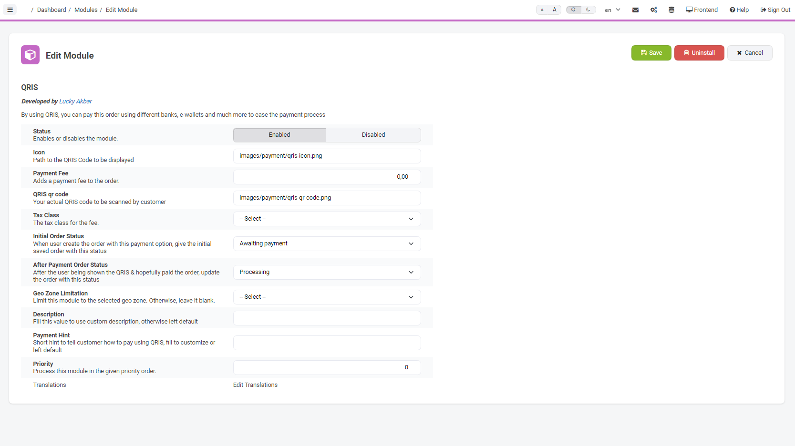
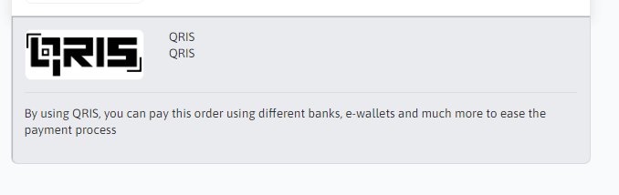
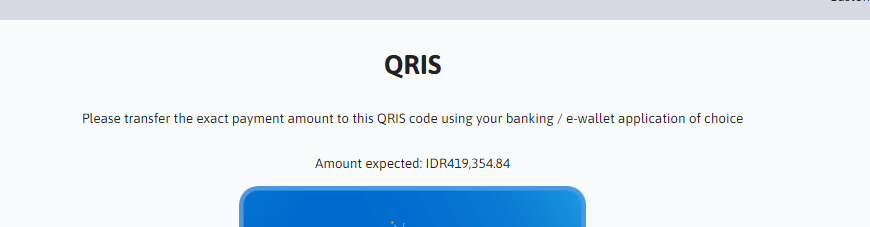
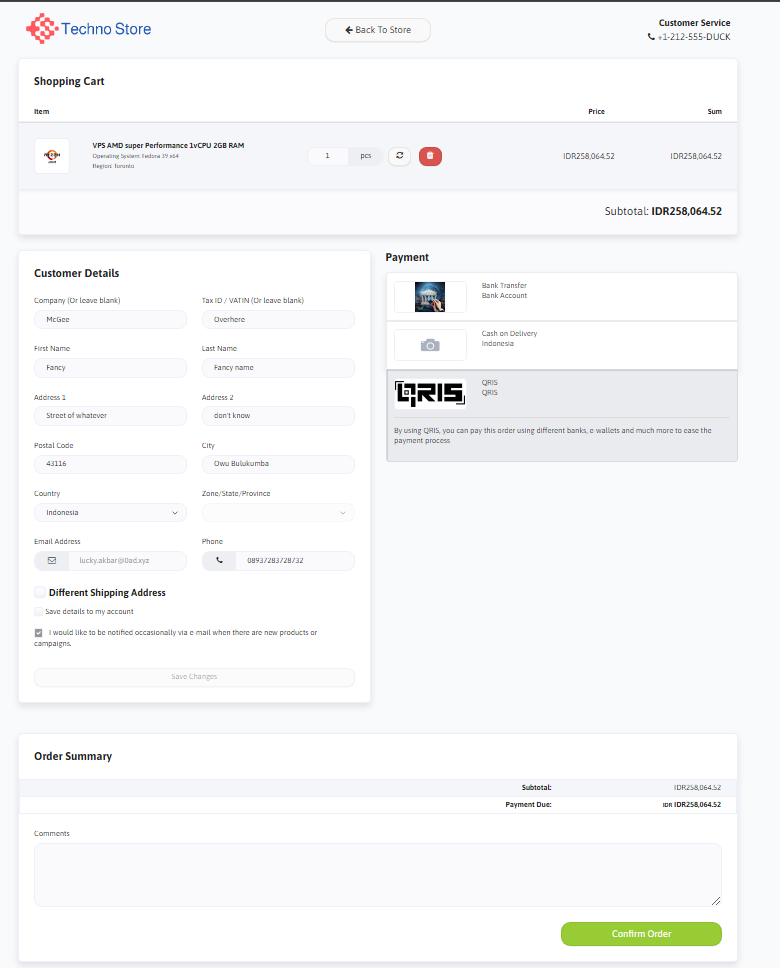
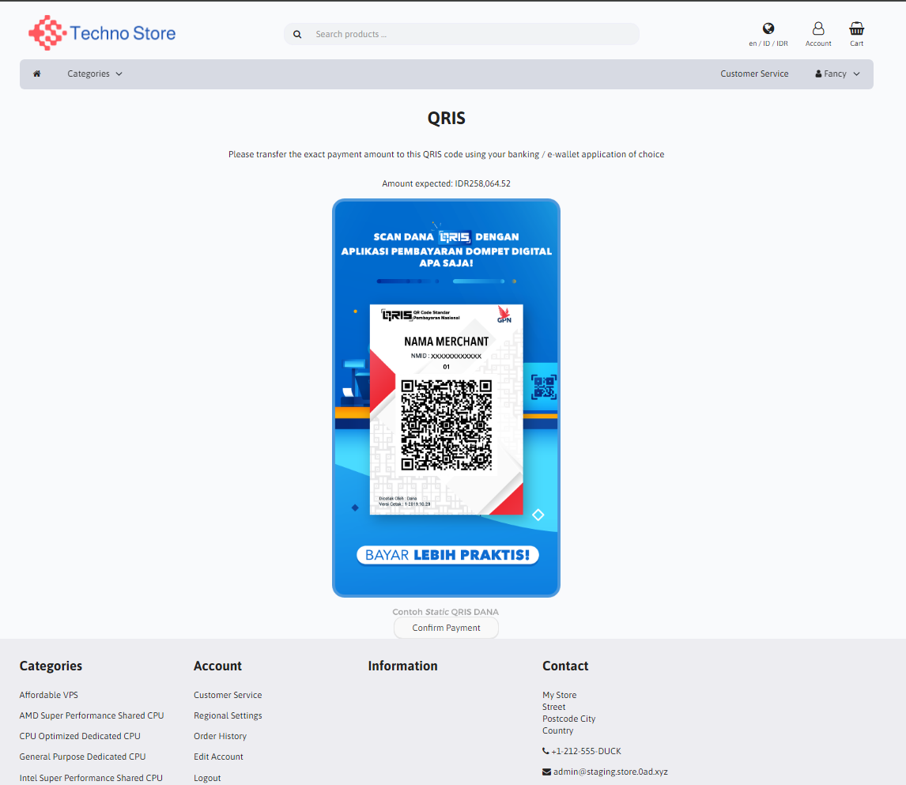
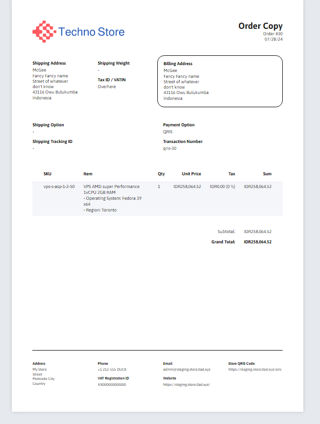

#  LiteCart QRIS Payment Module

This module will add a new payment option using static QRIS code to ease payment by customers by just scanning a qr code.

## What is QRIS

It's an abbreviation from Quick Response Code Indonesian Standard. This payment channel was created by the central bank of Indonesia (Bank Indonesia) and the details can be find here: [QRIS by Bank Indonesia](https://www.bi.go.id/QRIS/default.aspx#:~:text=Quick%20Response%20Code%20Indonesian%20Standard%20(QRIS)%20adalah%20standarisasi%20pembayaran%20menggunakan,%2C%20cepat%2C%20dan%20terjaga%20keamanannya)

## Features

What can you expect from this payment module is listed as below
1. Add new payment method using QRIS on checkout page
2. Add new page to show store QRIS code
3. Optional -> Add link to store QRIS code page on the order copy page and PDF

## Support

If you encouter errors or any problems during instalation and usage of this module, feel free to open an issue in this repository. Also if you have feature request, you can also opens a Pull Request.

## Live sample

I personally use this module on my e-commerce site. You can visit my site here: [live sample](https://link.0ad.xyz/store). Or you can also visit the litecart addons page for this module here [litecart addons for qris](https://www.litecart.net/en/addons/713/qris)

## How to install

Before installing this module, you must have:
1. QRIS code (preferably PNG).
2. QRIS logo (you can use the one here [qris logo](./assets/quick-response-code-indonesia-standard-qris-seeklogo-2.png)) 

To install this module is similar with doing other module instalation.
1. Take a look inside the [public_html](./public_html) and you will found 3 file. You can copy them manually and place them inside the same path as I do in this repo.
2. Upload your store's QRIS to your litecart folder. It must be placed and named like this ```public_html/images/payment/qris-qr-code.png```, otherwise the QRIS page can't render the QRIS image correctly.
3. Upload your  QRIS icon of choice just like before. In this example, I choose to place it here ```public_html/images/payment/qris-icon.png```. Please remember your path of choice as it will be required in the instalation page later.
4. Go to your admin panel
5. Access the Module menu
6. Access the sub menu for Payment Module
7. Install the module and fill the config values

### Configuration detail
On instalation process, the UI will looks like this


Here are the details of every available configuration value
1. Status -> choose whether to enable / disable this payment method
2. Icon -> path for the QRIS icon. Based on my example, the value should be ``` images/payment/qris-icon.png ```
3. Payment fee -> whether to add extra charges to customer if using this payment
4. QRIS qr code -> your store actual QRIS code. Based on my example, the value should be ``` images/payment/qris-qr-code.png ```
5. Tax class -> The tax class for the fee.
6. Initial order status -> When user do checkout using this payment method, what ordes status to give to that particular order. Take note that the order on this state is not yet paid because the user still not shown the store QRIS code. In this sample I choose ``` Awaiting Payment ```
7. After Payment Order Status -> After the user being shown the QRIS & clicking the Confirm Payment button, the order status will be updated with this value. Here I choose ``` Processing ```.
8. Geo Zone Limitation -> Limit this module to the selected geo zone. Otherwise, leave it blank.
9. Description -> Fill this value to use custom description, otherwise left default. This description value as payment option description and looks like this by default 
10. Payment Hint -> If you want to give custom payment hint to be shown as a 'how to pay' using QRIS. the default value are shown like this . The default value is ``` Please transfer the exact payment amount to this QRIS code using your banking / e-wallet application of choice ```
11. Priority -> Process this module in the given priority order.

### Optional features instalation

This module also offers optional feature to add a link to your store QRIS page. But because of this will have a huge chance of causing collition with existing file, I choose to not include this in the default instalation. So to install this feature, follow these steps
1. Open the optional file [here](./optional/printable_order_copy.inc.php)
2. Notice that this is the default page for printable copy provided by litecart
3. Find the code surrounded by this comment
```
// start of QRIS link on printable copy
...
// end of QRIS link on printable copy
```
4. Between those comments are a the code to show a new footer link for your store QRIS code. use this code for step number 5
5. Update your current printable copy file located at ``` public_html/includes/templates/default.catalog/pages/printable_order_copy.inc.php ```
5. Check the printable copy's footer or look at the sample in Screenshot number 3

## Screenshots

1. QRIS payment option on checkout page 
2. QRIS code shown to customer after checkout 
3. Printable copy with custom footer for qris page: 

## Consideration

1. This module doesn't currently support dynamic checking for transfered money, so any payment made using this option should be verified manually.
2. When developing this module, I don't considering translation support. So the default language is English. If you want to add dynamic language support, a PR is welcomed!